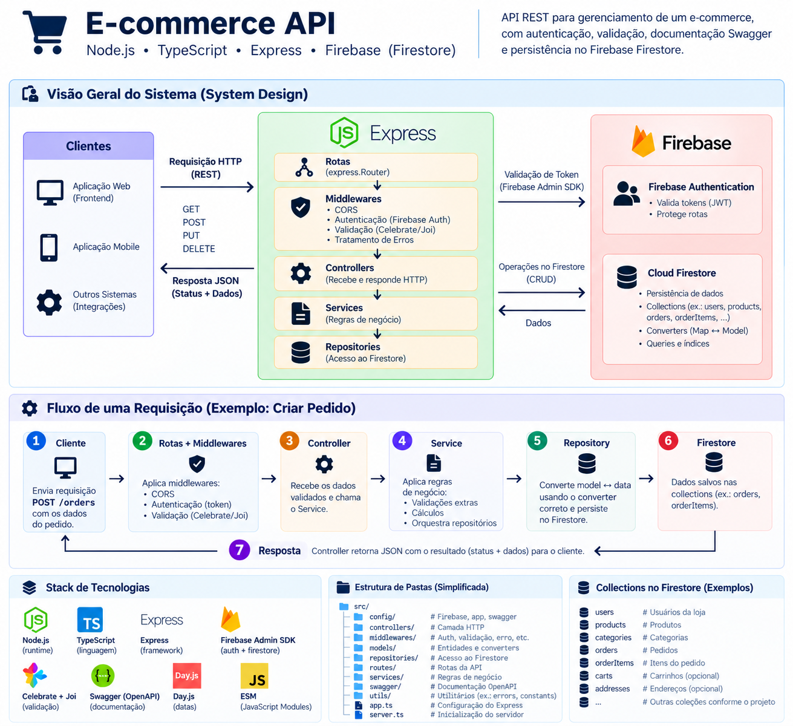

# E-commerce API

## Objetivo

API REST para gerenciamento de um e-commerce, desenvolvida com
**Node.js, TypeScript, Express e Firebase/Firestore**. O projeto
contempla autenticação, validação de dados, documentação Swagger,
persistência no Firestore e uma arquitetura organizada em camadas para
facilitar manutenção e evolução.

## System Design



O fluxo principal da aplicação segue a separação:

``` text
Cliente
  ↓
Rotas + Middlewares
  ↓
Controller
  ↓
Service
  ↓
Repository
  ↓
Firebase / Firestore
```

As requisições passam pelas rotas e middlewares de autenticação,
validação e tratamento de erros. Os controllers tratam a camada HTTP, os
services concentram as regras de negócio e os repositories são
responsáveis pelo acesso e persistência dos dados no Firestore.

## Visão geral

A API possui recursos para gerenciamento de:

-   autenticação;
-   usuários;
-   empresas;
-   categorias;
-   produtos;
-   formas de pagamento;
-   pedidos;
-   upload de arquivos;
-   documentação Swagger/OpenAPI.

A aplicação utiliza **Firebase Authentication** para autenticação e
**Cloud Firestore** para persistência. Os dados são convertidos entre
documentos do Firestore e models da aplicação por meio de
`FirestoreDataConverter`.

Para detalhes de implementação, padrões, convenções e regras para
evolução do projeto, consulte o [SKILL.md](SKILL.md).

## Stack principal

### Runtime e linguagem

-   Node.js 20
-   TypeScript
-   ES Modules
-   `module: "NodeNext"`
-   `moduleResolution: "NodeNext"`

### API

-   Express 5
-   express-async-handler

### Firebase

-   Firebase Admin SDK
-   Firebase SDK
-   Cloud Firestore
-   Firebase Authentication
-   Firebase Storage

### Validação e documentação

-   Celebrate
-   Joi
-   swagger-autogen
-   swagger-ui-express
-   OpenAPI 3

### Utilitários

-   Day.js
-   file-type

## Estrutura do projeto

``` text
src/
├── @types/
│   └── express.d.ts
├── controllers/
├── docs/
│   └── swagger-output.json
├── errors/
├── middleware/
├── models/
├── repositories/
├── routes/
├── services/
├── utils/
└── index.ts

docs/
└── system-design.png

lib/
└── código JavaScript compilado

SKILL.md
swagger.js
package.json
tsconfig.json
.env
```

### Organização das camadas

-   **controllers** --- recebem as requisições HTTP e delegam a execução
    aos services.
-   **services** --- concentram regras de negócio e coordenam operações
    entre repositories.
-   **repositories** --- realizam acesso, consultas e persistência no
    Firestore.
-   **models** --- representam entidades, schemas Joi, enums, tipos e
    converters.
-   **routes** --- definem endpoints, validações Celebrate e
    controllers.
-   **middleware** --- autenticação, autorização, tratamento de erros e
    rotas inexistentes.
-   **errors** --- erros customizados da aplicação.
-   **utils** --- funções utilitárias reutilizáveis.

## Documentação técnica

O detalhamento técnico foi separado para manter este README objetivo.

Consulte o **[SKILL.md](SKILL.md)** para:

-   inicialização e fluxo interno da aplicação;
-   convenções TypeScript e ESM;
-   padrões de routes, controllers, services e repositories;
-   Firestore e converters;
-   models e validação com Celebrate/Joi;
-   autenticação e tratamento de erros;
-   Swagger/OpenAPI;
-   scripts e arquivos gerados;
-   variáveis de ambiente e credenciais;
-   regras para criação de novos recursos;
-   regras para alterações feitas por IA;
-   pontos identificados para revisão;
-   checklist antes de finalizar alterações.
